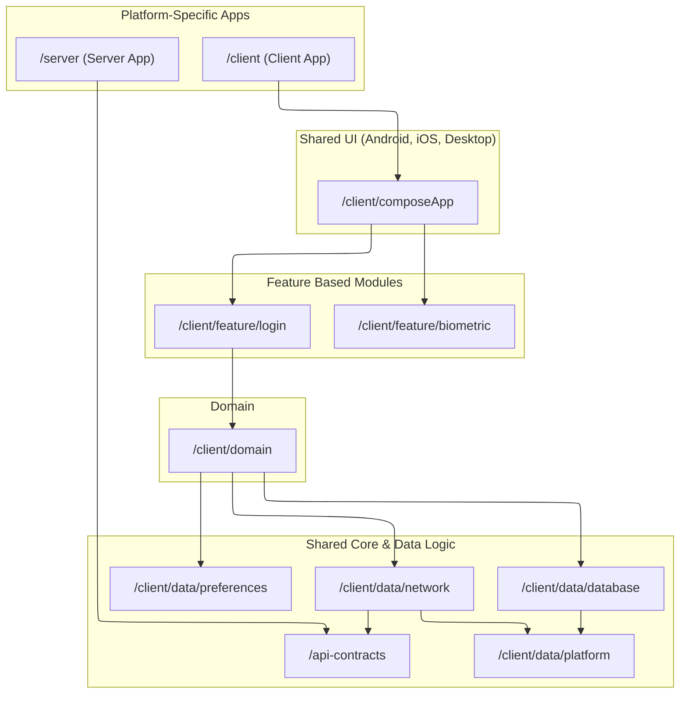

# Sample - Kotlin Multiplatform Project

[](https://github.com/louisgautier/Sample-Compose-Multiplatform/actions/workflows/ci.yml)
[](https://github.com/louisgautier/Sample-Compose-Multiplatform/releases/latest)

This is a Kotlin Multiplatform project targeting Android, iOS, Desktop (JVM), and Server. It allows for sharing code across different platforms, reducing development time and ensuring consistency.

## Project Structure & Modules

The project is organized into several modules, each serving a distinct purpose. Here\'s an overview of the key modules:

## Module Dependency Graph



### Core Modules (Multiplatform)

These modules contain shared logic and are compiled for multiple targets.

* **`/app/platform`**
    * **Description:** Manages core application functionalities such as AppLogger, Context wrapper
      and platform-specific utilities.
    * **Targets:** `commonMain`, `androidMain`, `iosMain`, `jvmMain`.
    * **Key Libraries:** Kermit.

*   **`/app/domain`**
    * **Description:** Houses the core business logic, use cases, preferences, and domain models of
      the application.
    * **Targets:** `commonMain`, `androidMain`, `iosMain`, `jvmMain` (for platform-specific
      Datastore).
    *   **Key Libraries:** Kotlin Standard Library, Kotlinx Coroutines.

*   **`/app/network`**
    *   **Description:** Implements the network client for making API requests to the backend server. It handles data fetching and communication.
    *   **Targets:** `commonMain` (for shared client logic), `androidMain`, `iosMain`, `jvmMain` (for platform-specific Ktor engines).
    *   **Key Libraries:** Ktor Client.

*   **`/app/database`**
    *   **Description:** Manages local data persistence, allowing the app to store and retrieve data on the device.
    *   **Targets:** `commonMain` (for database schemas, queries), platform-specific driver implementations (`androidMain`, `iosMain`, `jvmMain`).
    *   **Key Libraries:** Ksp, Room.

*   **`/api-contracts`**
    *   **Description:** Defines data models (Data Transfer Objects - DTOs) and API route definitions. This module is crucial for ensuring type-safe communication and sharing the contract between client modules (like `/app/network`) and the `/server`.
    *   **Targets:** `commonMain`.
    *   **Key Libraries:** Kotlinx Serialization.

### UI Module (Multiplatform)

*   **`/app/composeApp`**
    *   **Description:** Contains the shared user interface layer built with Compose Multiplatform. This allows for a consistent look and feel across Android, iOS, and Desktop.
    *   **Source Sets:**
        *   `commonMain` ([./app/composeApp/src/commonMain/kotlin](./app/composeApp/src/commonMain/kotlin)): Code common for all targets.
        *   Platform-specific (`androidMain`, `iosMain`, `jvmMain`): For platform-specific UI adaptations or API calls within the Compose UI. For example, `iosMain` ([./app/composeApp/src/iosMain/kotlin](./app/composeApp/src/iosMain/kotlin)) for iOS-specific Compose UI parts, or `jvmMain` ([./app/composeApp/src/jvmMain/kotlin](./app/composeApp/src/jvmMain/kotlin)) for Desktop.
    *   **Key Libraries:** JetBrains Compose Multiplatform.

### Platform-Specific Application Modules

*   **`/iosApp`** ([./iosApp/iosApp](./iosApp/iosApp))
    *   **Description:** The iOS-specific application project. It serves as the entry point for the iOS platform and integrates the shared UI from `/app/composeApp`. This is also where you would add any native SwiftUI code if needed.
    *   **Targets:** iOS.
    *   **Key Libraries:** UIKit/SwiftUI, integration with shared KMP modules.

*   **`/server`** ([./server/src/main/kotlin](./server/src/main/kotlin))
    *   **Description:** A backend server application built with Ktor. It provides the APIs consumed by the client applications.
    *   **Targets:** JVM.
    *   **Key Libraries:** Ktor Server.

*(Note: The Android application is primarily built from `/app/composeApp`\'s Android target, which produces an Android library consumed by a separate Android app module or uses a default application setup if `com.android.application` plugin is applied directly in `app/composeApp`.)*

## Gradle Build Logic with Convention Plugins

This project leverages Gradle\'s `build-logic` module to centralize and manage build configurations
through **convention plugins**. This approach promotes:

* **Consistency:** Ensures uniform application of settings, dependencies, and plugins across similar
  modules.
* **Maintainability:** Simplifies updates to build configurations as changes are made in one place.
* **Readability:** Reduces boilerplate in individual module `build.gradle.kts` files, making them
  cleaner and focused on module-specific declarations.

Convention plugins are defined as Kotlin classes plugins (e.g., `ApplicationPlugin`,
`LibraryPlugin`) within the `/build-logic/src/main/kotlin` directory.

Modules can then apply these conventions using a simple plugin ID, for example:

```kotlin
// In a module's build.gradle.kts
plugins {
    id("kotlin-multiplatform-convention")
    // ... other plugins
}
```

This setup helps in managing a complex multi-module project more efficiently.

## Understanding Source Sets (Targets)

In Kotlin Multiplatform modules, you\'ll typically find the following source sets:
*   `commonMain`: Code that is common to all targeted platforms.
*   `androidMain`: Kotlin code specific to the Android platform.
*   `iosMain`: Kotlin code specific to the iOS platform (compiled to Native).
*   `jvmMain`: Kotlin code specific to JVM environments (e.g., Desktop applications).
*   `(platform)Test`: Unit tests for a specific platform, e.g. `commonTest`, `jvmTest`.

## Build and Run

For detailed build and run instructions for each platform, please refer to the following sections.

### Build and Run Android Application

To build and run the development version of the Android app, use the run configuration from the run widget in your IDE’s toolbar or build it directly from the terminal:
- on macOS/Linux
  ```shell
  ./gradlew :app:composeApp:assembleDebug
  ```
- on Windows
  ```shell
  .\gradlew.bat :app:composeApp:assembleDebug
  ```

### Build and Run Desktop (JVM) Application

To build and run the development version of the desktop app, use the run configuration from the run widget in your IDE’s toolbar or run it directly from the terminal:
- on macOS/Linux
  ```shell
  ./gradlew :app:composeApp:run
  ```
- on Windows
  ```shell
  .\gradlew.bat :app:composeApp:run
  ```

### Build and Run Server

To build and run the development version of the server, use the run configuration from the run widget in your IDE’s toolbar or run it directly from the terminal:
- on macOS/Linux
  ```shell
  ./gradlew :server:run
  ```
- on Windows
  ```shell
  .\gradlew.bat :server:run
  ```

### Build and Run iOS Application

To build and run the development version of the iOS app, use the run configuration from the run widget in your IDE’s toolbar or open the `[./iosApp](./iosApp)` directory in Xcode and run it from there.

---
**Note on Libraries:** The key libraries mentioned are indicative. For a complete list of dependencies for each module, please refer to the `build.gradle.kts` (or `build.gradle`) file within that module\'s directory.
---

Learn more about [Kotlin Multiplatform](https.www.jetbrains.com/help/kotlin-multiplatform-dev/get-started.html)…

## Future Enhancements (TODO)

This section outlines planned improvements and potential areas for future development:

*   **Secure Data Storage on Android (SQLCipher/Room):**
    *   Investigate and implement encrypted local database storage on Android. This involves replacing the current placeholder database in the `/app/database` module with a robust solution like Room, potentially with SQLCipher for an added layer of security to protect sensitive user data.

*   **Firebase Authentication (Server-Side):**
    *   Implement user authentication on the `/server` using the Firebase Admin SDK. The server will handle token verification and user management, providing a secure authentication flow for all client applications.

*   **Koin Dependency Injection Module Verification:**
    *   Enhance testing by adding integrity checks for Koin modules. This involves writing tests (likely in `commonTest` or platform-specific test source sets) that utilize Koin\'s testing utilities to verify that all dependency graphs can be correctly resolved at runtime.

*   **Continuous Integration/Continuous Deployment (CI/CD) with GitHub Actions:**
    *   Set up GitHub Actions workflows to automate the building, testing, and potentially deployment of the Android app, iOS app (if feasible via command-line tools), desktop app, and server application. This will ensure code quality and streamline the release process.
